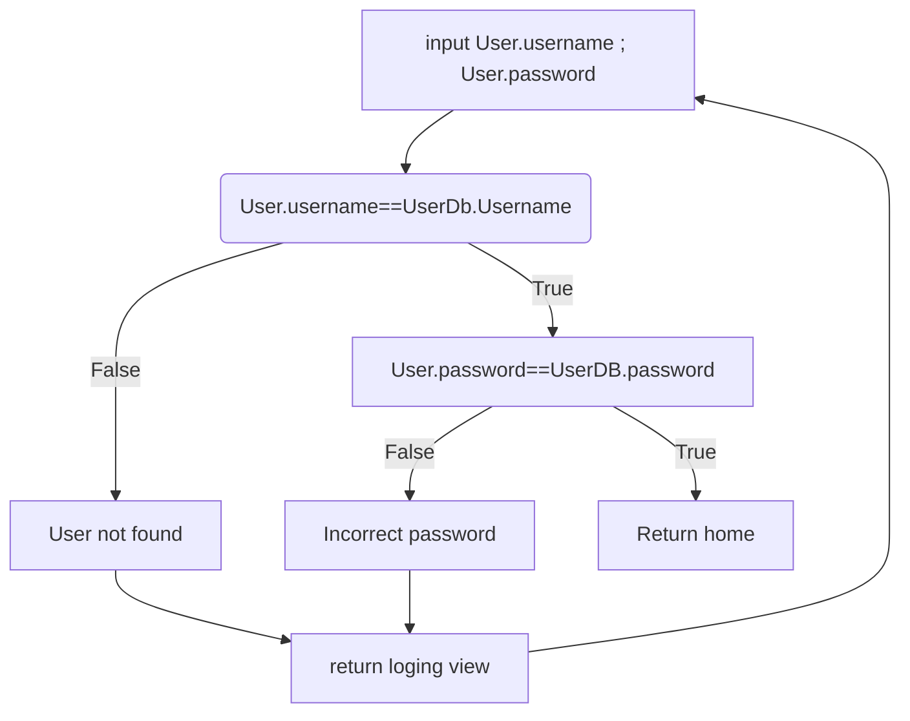
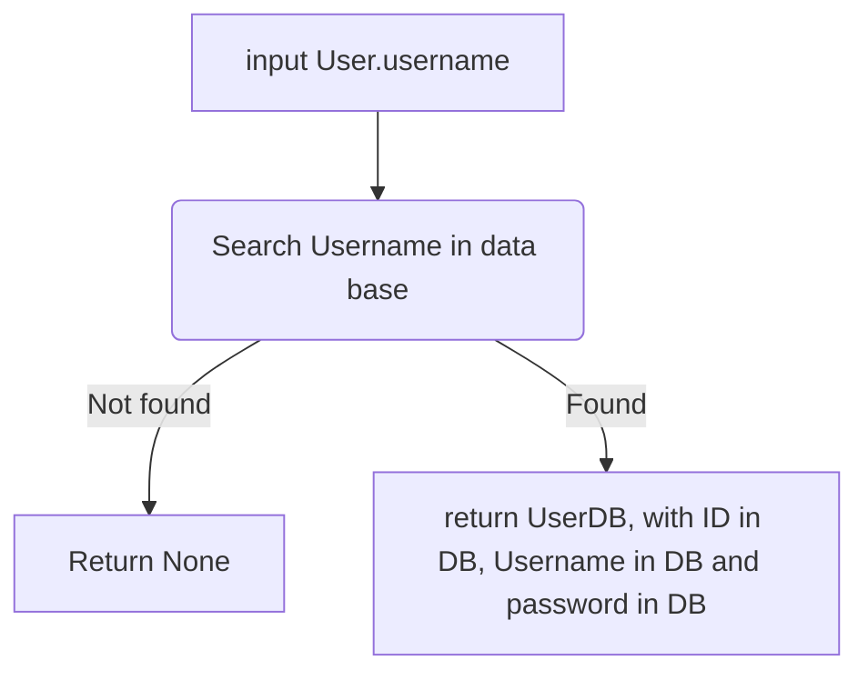
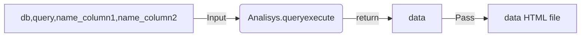

This is a example for how integrate in Flask, the visualization graphs use Bokeh library.
In this aplication you can find the structure for the API rest, with a DataBase using MySQL.

The content is in follow blocks:

  1. Login: For the login we use the follow logic.
     

for create this logic, you need to define some objects:
  1. The firs object is the User, this is a class that pass the username and the password. its very important because the user can interact with it, when the user input the username and the password, and ours code need to it for comparate in the DB than have the users and password, and asign it the values.
In the below lines you can see the creation from the class, call User, and this have a constructor, this constructor pass id,username and password.
  2. Look than I imported check_password_hash from werkzeug.security and creade other method from the class User, the class called CheckPassword, this class is used for check the password than the user input,we can use this method for return True or False.
  3. Look too than I imported UserMixin from flask_login, this is for can control the view for user, its for check that the user is login and ours code understand this state, and constrain some views, or in other case, show some kind of views.

```python
>>> from werkzeug.security import check_password_hash
from flask_login import UserMixin

class User(UserMixin):
    def __init__(self,id,username,password) -> None:
        self.id=id
        self.username=username
        self.password=password
    @classmethod
    def CheckPassword(self,hashpassword,password):
        return check_password_hash(hashpassword,password)
```
Other Object than we need is the UserDB,than is an instance for User, but we need a method that allow us check in the DB the "User" than the user input.
I mean, maybe its confuse, I put the follow diagram for you understand better.


Now you cand see, in the firs diagram when you compared the User.username with UserDB.username, if UserDB not exist for this specific username, return None.
In excencial you comparated a string with None, and ask if both are equal.

This is the code.
```python
>>>from models.entities.User import User
from flask import jsonify

class ModelUser():

    @classmethod
    def LoggedUser(self,db,user):
        try:
            cursor=db.connect.cursor()
            QUERY_USER=""" SELECT IDADMIN,USERNAME,PASSWORD
                        FROM administrator 
                        WHERE USERNAME='{}'""".format(user.username)
            cursor.execute(QUERY_USER)
            answer=cursor.fetchone()
            if answer !=None:
                user=User(answer[0],answer[1],User.CheckPassword(answer[2],user.password))
                return user
            
            else:
                return None
            
        except Exception as ex:
            raise Exception(ex)
```
for integrate the two function you need to create an app.py file
The diagram represent the integration of code for the login.


and this is the code, you need to create a some file with the configuration, is a good practice, for not create all in the same file.
```python
>>>
from flask import Flask,render_template,request,redirect,flash,url_for
from config import ConfigObject
from flask_mysqldb import MySQL
from flask_login import LoginManager,login_user,logout_user,login_required

app=Flask(__name__)
db=MySQL(app)

@app.route('/login',methods=['GET','POST'])
def login():
    if request.method=='POST':
        user=User(0,request.form['Username'],request.form['Password'])
        loggeduser=ModelUser.LoggedUser(db,user)
        if loggeduser !=None:
            
            if loggeduser.password:
                login_user(loggeduser)
                return redirect(url_for('home'))
            
            else:
                flash('Invalid Password')
                return render_template('Auth/login.html')
        
        else:
            flash('User not found')
            return render_template('Auth/login.html')
    else:
        return render_template('Auth/login.html')

if __name__=='__main__':
    app.config.from_object(ConfigObject)
    app.run()
```
for connect to a MySQL you need to import MySQL from flask_mysqldb
and configurate the credential in your file config, I show you how is this file in this example.
```python
>>>
class SecretKey():
    SECRET_KEY='JOKERGUASONJ@J@'

class ConfigObject(SecretKey):
    DEBUG=True
    MYSQL_HOST='localhost'
    MYSQL_USER='root'
    MYSQL_PASSWORD='89JQuery78#'
    MYSQL_DB='papercompany'
```
Now we review the API for make the graphs use Bokeh.
I created a class called Analisys, this have 3 methods(classmethods actually), the firs method is called queryexecute, this is interesting function, let me show us.
This function requiered 4 arguments, there are:

1. db: Database for connect
2. query: Query for make the sheare
3.name_column1: Its a name from categorical values.
4.name_column2: Its a name from numbers values.

and return a dictionary,a dictionary than have the resources of the graph.
I mean return the components for render the grpah from bokeh, so it´s mean than with this dictionary you can insert this graph in any html file than you want, in any place of lay out for this html file, in concrete this return this dictionary:

            data={
                "script":script,
                "div":div,
                "js_resources":js_resources,
                "css_resources":css_resources
                }
The flow for this function is the follow:

and the code for the function is the follow:

```python
>>>
import pandas as pd
from DataAnalisys.Graphs import Pareto,barra_stackeada
from bokeh.embed import components
from bokeh.resources import INLINE
from flask import jsonify

class Analisys():
    @classmethod
    def queryexecute(self,db,query,name_column1,name_column2):
        try:
            cursor=db.connection.cursor()
            cursor.execute(query)
            answer=cursor.fetchall()
            db.connection.commit()
            answers=[]
            for row in answer:
                answer_get={
                    name_column1:row[0],
                    name_column2:row[1]
                }
                answers.append(answer_get)
            
            JSONYFY_QUERY=jsonify({
                "TABLA":answers,
                "message":"Get data ok!!"       
            })
            json_table=JSONYFY_QUERY.get_json()
            DATA_FRAME=pd.json_normalize(json_table['TABLA'])
            DATA_FRAME[name_column2]=DATA_FRAME[name_column2].astype(float)
            pareto=Pareto(DATA_FRAME,name_column1,name_column2)
            script,div=components(pareto)
            js_resources=INLINE.render_js()
            css_resources=INLINE.render_css()
            data={
                "script":script,
                "div":div,
                "js_resources":js_resources,
                "css_resources":css_resources
                }
            return data
            
        except Exception as ex:
            raise Exception(ex)
```
for can pass this to html file you need to use the jinja2 sintaxis.

```html
>>>
<!DOCTYPE html>
<html lang="en">
<head>
    <meta charset="UTF-8">
    <meta name="viewport" content="width=device-width, initial-scale=1.0">
    <title>   </title>
    <link href="https://cdn.jsdelivr.net/npm/bootstrap@5.3.3/dist/css/bootstrap.min.css" rel="stylesheet" integrity="sha384-QWTKZyjpPEjISv5WaRU9OFeRpok6YctnYmDr5pNlyT2bRjXh0JMhjY6hW+ALEwIH" crossorigin="anonymous">

    
    
    
    
    
    

</head>
<body>


    
    

    <script src="https://cdn.jsdelivr.net/npm/bootstrap@5.3.3/dist/js/bootstrap.bundle.min.js" integrity="sha384-YvpcrYf0tY3lHB60NNkmXc5s9fDVZLESaAA55NDzOxhy9GkcIdslK1eN7N6jIeHz" crossorigin="anonymous"></script>

</body>
</html>
```

